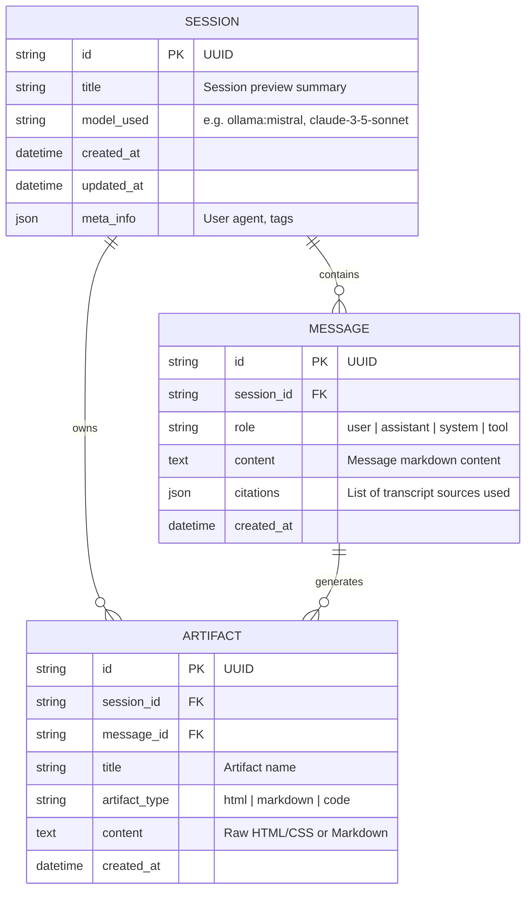

# System Architecture Document
## Project: The Lenny Growth Assistant

---

## 1. High-Level Architecture Overview

The Lenny Growth Assistant is designed as a modular, decoupled full-stack system built to be forward-deployed into enterprise or local developer environments.

```
┌─────────────────────────────────────────────────────────────────────────────┐
│                             CLIENT LAYER                                    │
│  React / Next.js / Tailwind CSS / Radix UI / Lucide Icons                   │
│  ┌─────────────────────────┐          ┌──────────────────────────────────┐  │
│  │   Chat & Session View   │ ◄──────► │  Claude-Style Artifact Viewer    │  │
│  │   (SSE Token Stream)    │          │  (Sandboxed IFrame Preview)      │  │
│  └────────────▲────────────┘          └────────────────▲─────────────────┘  │
└───────────────┼────────────────────────────────────────┼────────────────────┘
                │ HTTP REST / SSE Stream                 │
┌───────────────▼────────────────────────────────────────┴────────────────────┐
│                             API GATEWAY                                     │
│  FastAPI (Uvicorn / Async Python 3.11+)                                     │
│  ┌───────────────────────┐  ┌─────────────────────┐  ┌───────────────────┐  │
│  │ /api/chat (Streaming) │  │ /api/sessions       │  │ /api/models       │  │
│  └───────────────────────┘  └─────────────────────┘  └───────────────────┘  │
└──────────────────────────────────────┬──────────────────────────────────────┘
                                       │
┌──────────────────────────────────────▼──────────────────────────────────────┐
│                             AGENTIC CORE                                    │
│  ┌───────────────────────────────────────────────────────────────────────┐  │
│  │ Agent Router & Tool Dispatcher                                        │  │
│  │ ├─ Tool 1: search_podcast_knowledge (RAG retrieval)                   │  │
│  │ ├─ Tool 2: generate_ship30_essay (Ship 30 for 30 Content Skill)      │  │
│  │ └─ Tool 3: render_growth_artifact (Interactive HTML/MD generator)     │  │
│  └──────────────────┬─────────────────────────────────┬──────────────────┘  │
│                     ▼                                 ▼                     │
│  ┌──────────────────────────────────┐ ┌──────────────────────────────────┐  │
│  │ Local LLM Provider (Ollama)      │ │ Cloud LLM Provider               │  │
│  │ - mistral / qwen2.5 / llama3     │ │ - Anthropic Claude (Claude SDK)  │  │
│  │ - Zero API keys, local demo      │ │ - OpenAI GPT-4o                  │  │
│  └──────────────────────────────────┘ └──────────────────────────────────┘  │
└──────────────────────┬────────────────────────────────┬─────────────────────┘
                       │                                │
┌──────────────────────▼──────────────┐  ┌──────────────▼─────────────────────┐
│      HYBRID RETRIEVAL ENGINE        │  │        PERSISTENCE LAYER           │
│  ┌────────────────────────────────┐ │  │  PostgreSQL (Supabase / Railway)   │
│  │ BM25 Lexical Keyword Search    │ │  │  Fallback: SQLite Local Storage    │
│  ├────────────────────────────────┤ │  ├────────────────────────────────────┤
│  │ Dense Semantic Embeddings      │ │  │ - Sessions                         │
│  ├────────────────────────────────┤ │  │ - Messages & Sources               │
│  │ Lenny Podcast Transcripts (300+)│ │  │ - Artifacts (MD / HTML)            │
│  └────────────────────────────────┘ │  └────────────────────────────────────┘
└─────────────────────────────────────┘
```

---

## 2. Database Schema (PostgreSQL / SQLite)

The persistence layer is managed via **SQLAlchemy Async ORM**. It is configured to run against PostgreSQL (e.g. Supabase, Railway, or local Docker) and includes an automatic fallback to SQLite if PostgreSQL is not provisioned or offline.

### 2.1 Entity Relationship Diagram


---

## 3. Ingestion & Grounding Pipeline (RAG)

### 3.1 Corpus Source
Transcripts are ingested from `ChatPRD/lennys-podcast-transcripts`.
* **Corpus Stats**: 300+ full episodes covering guest interviews from Lenny Rachitsky's podcast.
* **Pre-indexed Topics**: The repository provides curated topical indices (e.g. `product-market-fit.md`, `retention.md`, `growth-strategy.md`) as well as full episode transcripts.

### 3.2 Chunking & Metadata Enrichment
1. **Episode Extraction**: Each episode file is parsed for guest name, episode title, publication date, and YouTube / podcast URLs.
2. **Chunking**: Transcripts are chunked using recursive semantic splitting (~600–800 tokens with 100 token overlap) keyed to speaker turn boundaries (e.g. `Lenny:`, `[Guest]:`).
3. **Metadata Index**: Every chunk retains:
   ```json
   {
     "episode_id": "rahul-vohra",
     "guest": "Rahul Vohra",
     "title": "How Superhuman Built An Engine For Product-Market Fit",
     "chunk_id": "rahul-vohra_c12",
     "text": "..."
   }
   ```

### 3.3 Hybrid Retrieval Flow
1. **Lexical Retrieval (BM25)**: Matches exact practitioner jargon, guest names (e.g. "Elena Verna", "Balfour", "PMF survey").
2. **Dense Semantic Retrieval**: Computes cosine similarity between user query and chunk embeddings.
3. **Reciprocal Rank Fusion (RRF)**: Merges top-k lexical results and dense results into a unified grounded context window.
4. **Grounding Guardrail**: If top ranking relevance score is below threshold $\theta$, the agent routes to a refusal response:
   *"I searched Lenny's podcast archives for this topic, but no matching discussion was found in the transcripts."*

---

## 4. Agent Architecture & LLM Toggle

### 4.1 Unified LLM Adapter
The agent interacts with an abstract LLM interface `BaseLLMClient`:
* `OllamaClient`: Talks to local Ollama instance (`http://localhost:11434/api/chat`). Zero API keys required. Perfect for private, offline, low-cost forward deployment.
* `ClaudeClient`: Leverages Anthropic Claude SDK (`claude-3-5-sonnet-20241022`) for cloud execution.
* `OpenAIClient`: Standard OpenAI chat completion fallback.

### 4.2 Agent Skills & Tools
1. `search_transcripts(query: str, guest_filter: Optional[str])`:
   Searches the hybrid index and returns formatted snippets with citations.
2. `generate_ship30_essay(topic: str, context: str)`:
   Applies the Ship 30 for 30 methodology:
   - Compelling hook (Curiosity + Benefit)
   - 1-3-1 rhythm and whitespace pacing
   - High skimmability (headers, bullet points, bold key insights)
   - Specific actionable takeaways
   - Target word count: ~1,250 words
3. `create_artifact(title: str, artifact_type: str, content: str)`:
   Emits a structured artifact payload to be consumed and displayed by the frontend Artifact Viewer.

---

## 5. Security & Isolation Strategy for Untrusted Artifacts

Generated HTML/CSS and scripts present code execution and Cross-Site Scripting (XSS) risks. The frontend employs a strict defense-in-depth isolation strategy:

1. **Sandboxed IFrame Execution**:
   * Rendered in `<iframe sandbox="allow-scripts" srcDoc={content} />`.
   * Specifically **omits `allow-same-origin`**. Without `allow-same-origin`, the script inside the iframe runs in a unique, null-origin security context, preventing access to the parent page's `localStorage`, `cookies`, `sessionStorage`, or DOM.
2. **Content Security Policy (CSP)**:
   * The iframe's injected document contains:
     `<meta http-equiv="Content-Security-Policy" content="default-src 'none'; style-src 'unsafe-inline' https://cdn.tailwindcss.com; script-src 'unsafe-inline';">`
   * Prevents outbound network calls (`connect-src 'none'`) or asset leakage.
3. **Sanitization for Markdown**:
   * Markdown preview uses DOMPurify + marked with HTML tags stripped or escaped unless explicitly wrapped in the artifact code viewer.

---

## 6. API Endpoints Specification

| Method | Path | Description |
|---|---|---|
| `GET` | `/api/health` | Diagnostic status of DB, Ollama, and RAG index |
| `GET` | `/api/models` | List available local Ollama models and cloud providers |
| `POST` | `/api/sessions` | Create a new conversation session |
| `GET` | `/api/sessions` | List all conversation sessions with preview snippets |
| `GET` | `/api/sessions/{id}` | Get full conversation history and attached artifacts |
| `DELETE` | `/api/sessions/{id}` | Delete a conversation session |
| `POST` | `/api/chat` | Main SSE streaming endpoint for messages and tool calls |
| `GET` | `/api/artifacts/{id}` | Fetch a specific artifact |
| `POST` | `/api/transcripts/search` | Direct search query against transcript database |
